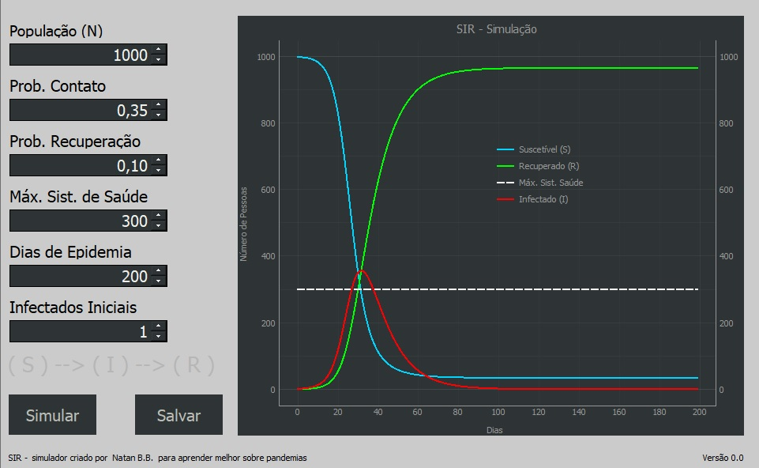

# SIR-Simulador
Criando um simulador para começar a entender como podemos simular a progressão de contágios por um vírus em determinada população onde alguns parâmetros são conhecidos.

https://www.youtube.com/watch?v=E9NilrFzANE
